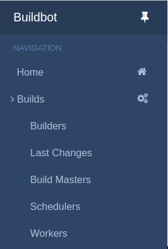
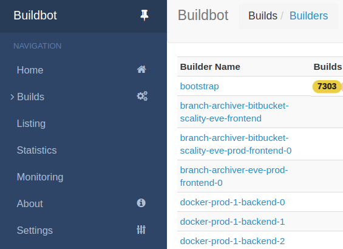
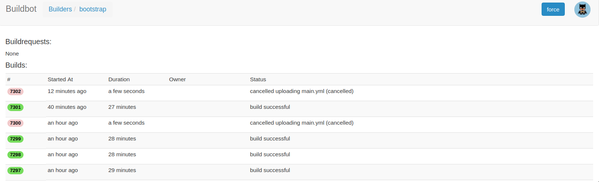
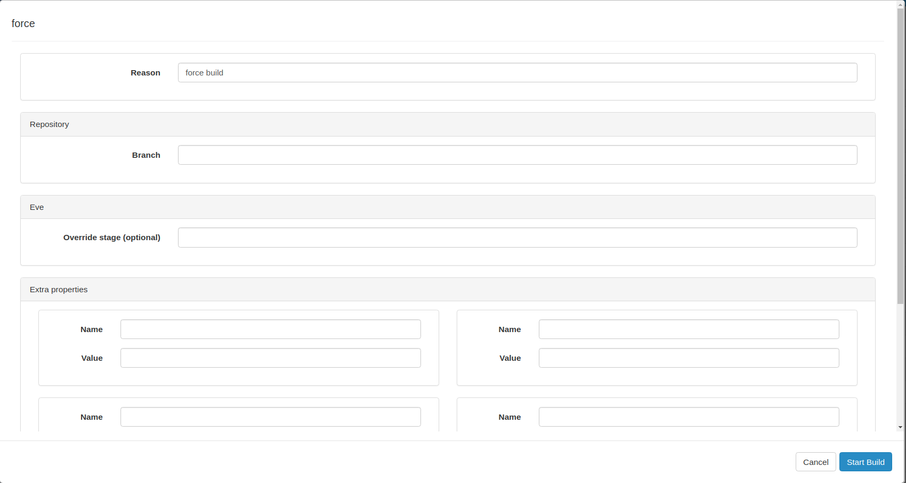

Frequently asked questions
==========================

How do I force a build on a branch?
-----------------------------------

On the UI main page select:
``builds`` -> ``builders`` -> ``bootstrap`` -> ``force`` -> enter your branch's name

Click on ``builds`` -> ``builders``:

Select the ``bootstrap``:

Click on the ``force`` bar on the up right :

Then fill up the ``form``:

Setup the branch name you want to build and click on ``Start Build``.

How do I force a build on a commit?
-----------------------------------

Currently, eve refuses to build a commit that is not a tip of a branch. You need
to create a user/* branch pointing on it and push it. The results will be
accessible from the git provider interface: https://bitbucket.org/<owner>/<your
repo>/branches/ or https://github.com/<owner>/<your repo>/branches

Can I have parameterized builds?
--------------------------------

A few options are available on the build form:

Optionally there's a ``Override stage`` option that provide the ability to build
a single stage (can be useful to trigger post-merge builds on a feature/bugfix
branch).

It's possible to bind this feature with the ability to override build
properties.  The field ``Extra Properties`` is available for this purpose.
Proper steps will be skipped inside the build pipeline and the values defined
in the form will be set instead.

Per example for the `Ring`_ project, on the ``post-merge`` stage,
overwriting the ``premerge_artifacts_names`` property allow you to start a
``post-merge`` build with any artifacts available.

The form might look like this:

+----------------------------------+-----------------------------------+
| Build form example                                                   |
+==================================+===================================+
| branch                           | ``feature/new-stuff``             |
+----------------------------------+-----------------------------------+
| stage                            | ``post-merge``                    |
+----------------------------------+-----------------------------------+
| properties name                  | ``premerge_artifacts_names``      |
+----------------------------------+-----------------------------------+
| properties value                 | ``bitbucket:scality::ring:...``   |
+----------------------------------+-----------------------------------+

Can I have access to the workers?
---------------------------------

Yes and no. There is no easy way to do it today with eve. We need to give root
access to the platform. It is a bit dangerous so we avoid doing it for everybody
in the company but will definitely do on demand.

How can I get help?
-------------------

The HipChat ``Community support (RELENG projects)`` room is the place to go. The
Release Engineering team dedicates one person every day (The Night's Watch lord
Commander) to answer questions in this room.

.. _ring: https://bitbucket.org/scality/ring
