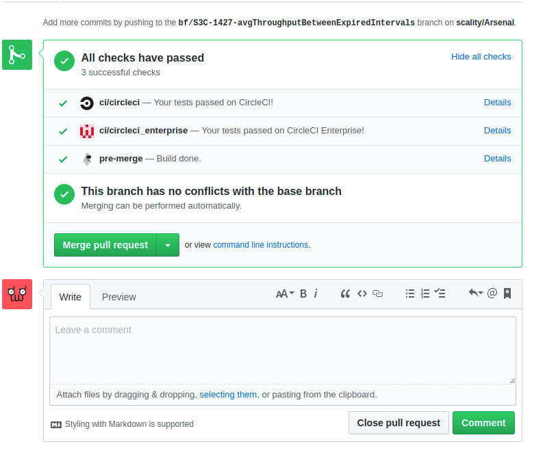
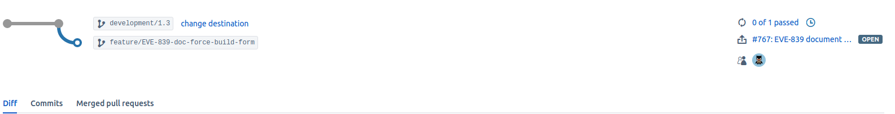
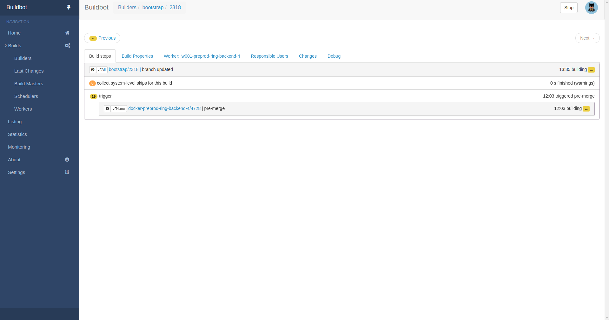

Yet another CI engine?
======================

Buildbot as the build engine
----------------------------

Many CI tools are structured as ready-to-use applications. Users fill in
specific details, such as version control information and build process, but the
fundamental design is fixed and options are limited to those envisioned by the
authors. This arrangement suits the common cases quite well: there are
cookie-cutter tools to automatically build and test Java applications, Ruby
gems, and so on. Such tools embody assumptions about the structure of the
project and its processes. They are not well-suited to more complex cases, such
as mixed-language applications or complex release tasks, where those assumptions
are violated.

Buildbot must be seen more as a library than a ready-to-use tool. It offers you
a maximum of flexibility to build your pipeline. Basically, if you need to add
a feature, you just have to create a Python class that inherits from one of
buildbot's core classes and change their behavior. Extremely powerful!

Another great feature in buildbot is that it uses a database to store all of its
data. The database's model is available and allows us to get stats, to monitor
and to troubleshoot issues easily.

How does eve work?
------------------

For every received webhook, eve checks out the relative git branch and looks in
the target repository for a yaml file, under ``eve/main.yaml``. This file will
dictate the behavior of the pipeline for that specific commit.

Depending on the presence/absence of ``eve/main.yaml`` and on its contents, eve
will eventually decide to start a build.

Once the build finished, eve will report its outcome to github/bitbucket using
their respective APIs, by setting a status on the commit that has entered the
pipeline. The build status is displayed on their web ui (see screenshots below).

On Github
+++++++++

On Bitbucket
++++++++++++

Clicking on the status badges will take you to eve's interface (See screenshot
below).

.. warning::
    Currently, eve has some security holes and if you have sensitive
    informations in your pipeline or repository (i.e. passwords), it is advised
    to only allow access to it through local network or VPN.
