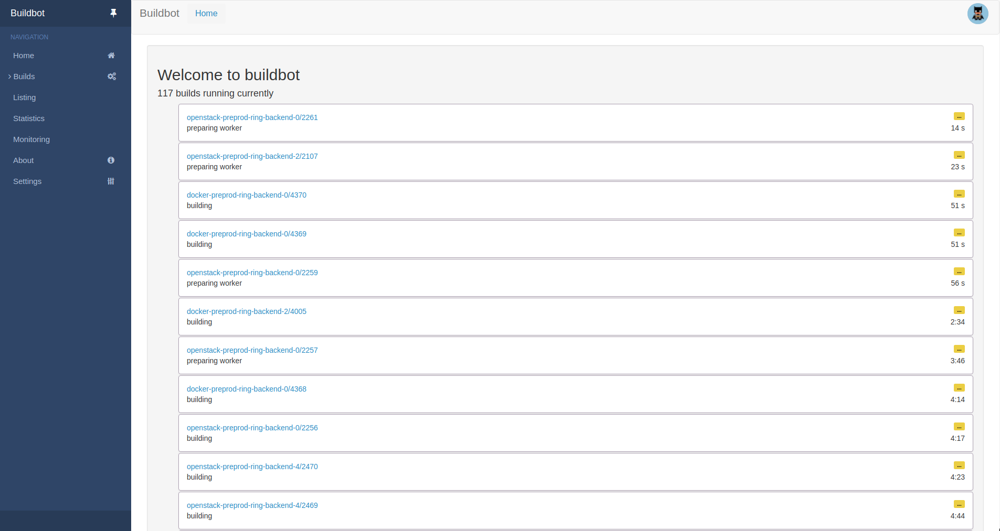
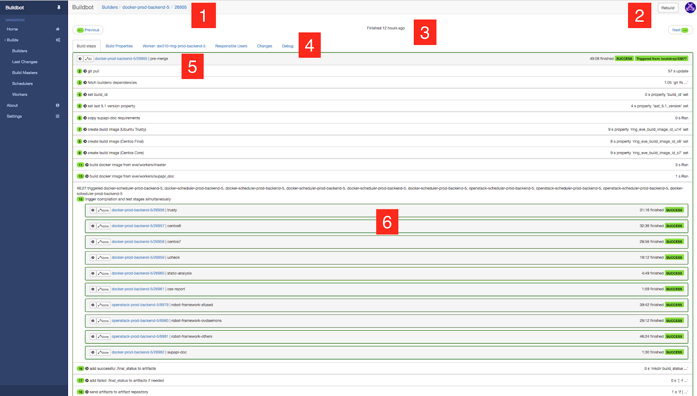

User interface
==============

main page
---------

This is the landing page you'll see when typing eve url directly in your
browser.

Most of the space is taken up by the list of current running builds (in
buildbot's parlance, so 'stages' for eve).

In the top-right corner you'll see your avatar (or a button to log yourself in
using github or bitbucket oauth depending of the repository).

On the left you have eve's menu bar. It is always displayed on every page of the
UI and gives you access to:

Home
    Link back to the landing page

Builds
    Contains folded menu links which show workers, schedulers, build masters...
    You probably won't need this as its mostly internals component you don't
    need to worry about.

    You'll only need the *Builders* page that then lets you select *Bootstrap*
    to manually force a new build.

Listing
    Let you list the build over the last *x* days, filtering on *branch* and
    *build result*.

Statistics
    Provide some basic statistics about the build durations and status for the
    last *x* days.

Monitoring
    You'll probably won't need it if you're not the one in charge of eve.
    This page gives you access to various health metrics on the pipeline.

Documentation
    Eve user documentation. That's where you are currently.

Wall-E
    Status page of Wall-E for this repository.

About
    Gives some information on the version of eve currently running.

Settings
    Buildbots UI settings. Mostly irrelevant for eve.

build page
----------

1. build number.

2. relaunch builds. Note that only “bootstrap” (or “root”) builds can be rebuilt
   (buildbot notion of build is slightly different than a pipeline run; the
   pipeline will contain one bootstrap build and several sub-builds, in buildbot
   terminology). Build failures can be categorized as “normal” (the pipeline
   caught an error in the code of the commit), environmental issues (frequent
   when the pipeline relies on external sources), or test flakiness (tests that
   fail, but not always, and the failure may not be related to the changes in
   the commit). For the later two, it is good practice to take a look at the
   logs and try to fix the flakiness or, at least file a bug. Flakiness is
   a very annoying technical debt and we need to keep it at its minimum.

3. the duration field shows you the build duration when the build is running and
   then shows you the build's age.

4. Build page tabs

   * Build steps shows you the shape of your pipeline as designed in
     eve/main.yml file. We will go through its details later.

   * Build properties shows you a dictionary of keys/values of variables that
     can be used by your pipeline. Properties are similar to environment
     variables but are `more powerful`_. You can add/update your own properties
     but there are some provided to you by eve/buildbot from scratch:

     - branch name

     - git sha1

     - ...

   * Worker tab: gives you some information on the worker that executed the
     stage. In this example, it is a docker container.

   * Responsible users: Who did the git push?

   * Changes: Which git changes triggered the build?

   * Debug: Some extra-debug information (buildbot version, buildbot master
     name, ...)

.. _more powerful: http://docs.buildbot.net/latest/manual/cfg-properties.html
