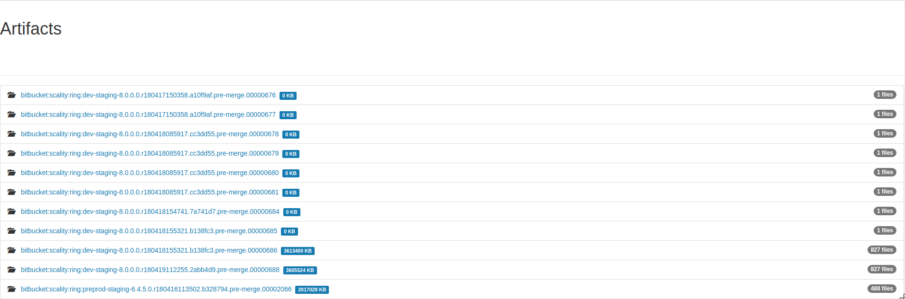

Build artifacts
===============

Your builds generate a lot of data that you'll want to keep:

   * Test reports

   * Core dumps

   * binaries

   * packages

   * ...

Eve can keep your artifacts for 14 days if your commit is not promoted and
forever if the commit is promoted.

To upload an artifact, store all the files you want to upload in a single
directory (e.g. artifacts/).
Then add an Upload step and give it the name of the folder, like below:

.. code-block:: yaml
   :caption: eve/main.yml

   - ShellCommand:
       name: "prepare artifacts to be uploaded"
       command: >
           mkdir -p artifacts/repo artifacts/installer artifacts/sources
           ; cd artifacts/repo
           && ln -s `echo ../../build/prod/packages/repository/[0-9]*` %(prop:os_name)s
           && ln -sf ../../build/prod/packages/repository/init.log %(prop:os_name)s-init.log
           && ln -sf ../../build/prod/packages/repository/add-scality.log %(prop:os_name)s-add-scality.log
           && ln -sf ../../build/prod/packages/repository/add-3rdparty.log %(prop:os_name)s-add-3rdparty.log
           && cd ../../artifacts/installer
           && ln -s `echo ../../build/prod/installer/scality-ring-*.run` .
           && cd ../../artifacts/sources
           && find ../../build/prod/ -name '*.tar.gz'
           && ln -s `echo ../../build/prod/pyscaldisk/scaldisk-*.tar.gz` .
           # scaldisk tarball is produced on all distribs and pushed 3 times
       haltOnFailure: True
       alwaysRun: True
   - Upload:
       source: "artifacts"
       urls:
         - ['\1.run', 'installer/*.run']
       alwaysRun: True

The property ``%(prop:artifacts_public_url)s`` will contain the URL of the
uploaded content.

Artifacts are also available for download from a web browser (see screenshots).

