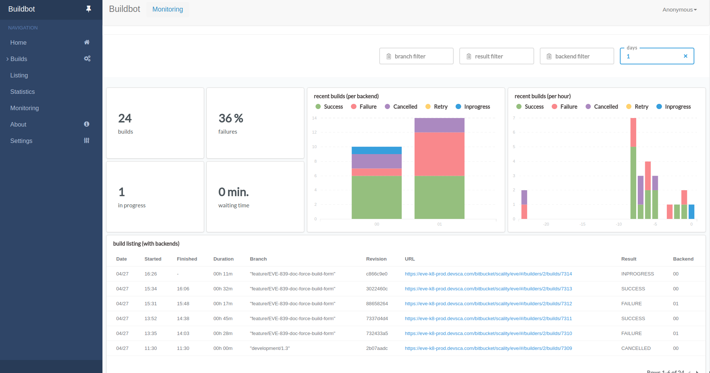

Statistical viewer with Metabase
--------------------------------

Under https://eve.devsca.com/<provider>/<owner>/<project>/metabase we have
installed metabase.
This allows us to have real-time stats for the whole repo.

Most of the dashboards are already available on buildbot UI sidebard.

If you want to add your own stats, you'll need some help from RelEng to get you
up and running.
