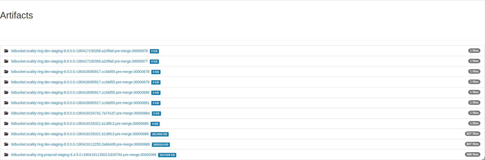

Build artifacts
===============

Your builds generate a lot of data that you'll want to keep:

   * Test reports

   * Core dumps

   * binaries

   * packages

   * ...

Eve can keep your artifacts for 14 days if your commit is not promoted and
forever if the commit is promoted.

Artifacts are available for download from a web browser (see screenshots).

Create and upload artifacts
---------------------------

To upload an artifact, store all the files you want to upload in a single
directory (e.g. artifacts/).

Eve additionally requires the following mandatory rule to be implemented
for each repository that requires artifacts upload:

- :ref:`the script get_product_version.sh<get_product_version>` *must* exist
  and *must* return a string of 3 or 4 integers separated by dots.

Then add an Upload step and give it the name of the folder, like below:

.. code-block:: yaml
   :caption: eve/main.yml

   - ShellCommand:
       name: "prepare artifacts to be uploaded"
       command: >
           mkdir -p artifacts/repo artifacts/installer
           && cd artifacts/repo
           && ln -s `echo ../../build/prod/packages/repository/[0-9]*` %(prop:os_name)s
           && cd ../../artifacts/installer
           && ln -s `echo ../../build/prod/installer/installer*.run` .
       haltOnFailure: True
       alwaysRun: True
   - Upload:
       source: artifacts
       urls:
         - ['\1.run', 'installer/*.run']
       alwaysRun: True

Permanent archival
------------------

Eve can archive artifacts permanently, via a promotion mechanism, with the
following requirements:

- a tag which does not contain the '/' character exists in the repository for
  the commit hash of the build we want to promote.

- a set of artifacts corresponding to a SUCCESSFUL build exists for the hash
  on which the tag points (this induces that promotion can only occur within
  14 days of the last successful build).

In order for this to work, this version of Eve additionally requires the
following mandatory rule to be implemented for each repository that requires
artifacts archival:

- The finalized artifacts container *must* contain a file named
  `build_status/.final_status`, which contains the global status of the build
  (i.e. the string SUCCESSFUL or the string FAILED). It is currently the
  responsibility of the repository yaml to ensure this file is reachable from
  the root of artifacts. It can be achieved with the following yaml at the very
  end of a build for example:

.. code-block:: yaml
   :caption: how to finalize artifacts for promotion

   - ShellCommand:
       name: add successful .final_status to artifacts
       command: >
           mkdir build_status
           && echo -n "SUCCESSFUL" > build_status/.final_status

To launch a promotion, connect to the Eve web interface of your repository under
"bootstrap" builders. Then, click on the "promote" button. You will have to give
the name of the build artifacts you want to promote as you can see it listed under
"/artifacts/builds/" in the web interface. You will also have to give the git tag.
Eve will copy the builds artifacts under a new name suffixed by the tag. This
copy will not be expired/deleted.

Related build properties
------------------------

The property ``%(prop:artifacts_private_url)s`` can be used by other steps to
access, password free, a local and cached copy of artifacts already produced.

The property ``%(prop:artifacts_public_url)s`` will contain the URL of the
uploaded content for users outside the CI.

The property ``%(prop:product_version)s`` contains the version string of
the product, as returned by :ref:`the product version script
<get_product_version>`, if installed, ``0.0.0`` otherwise. This version
is printed in the artifacts bucket name.
